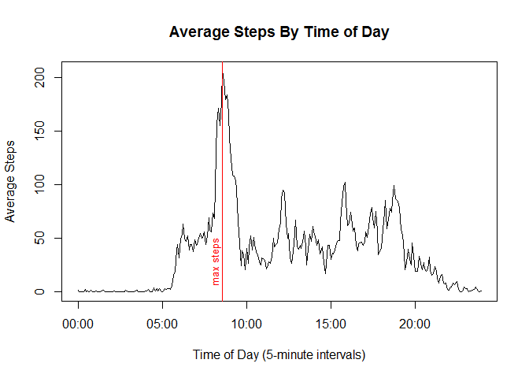
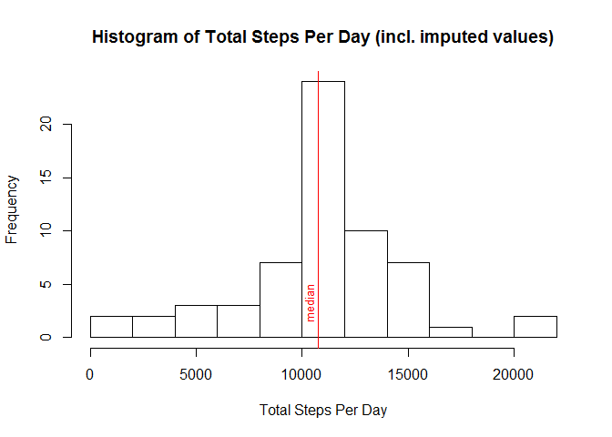
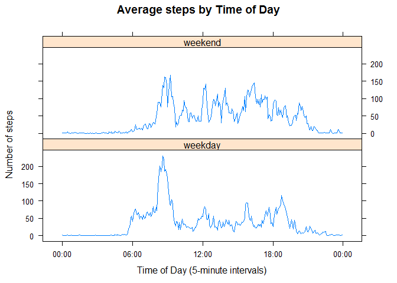

# Reproducible Research: Peer Assessment 1
    

```r
## prevent markdown from showing scientific notation for small numbers
options(scipen = 999, digits = 2)
```

## Loading and preprocessing the data

The following code will load and process the data:

```r
## check if file exists and extract zip if necessary
if(!file.exists("data/activity.csv")) {
    unzip("activity.zip", exdir = "data")
}

## read data and convert date column to date format
data <- read.csv("./data/activity.csv", stringsAsFactors = FALSE)
data$date <- as.Date(data$date)
```

## What is mean total number of steps taken per day?

The *dplyr* library will be used to aggregate daily totals. The histogram is plotted with the base plotting package:

```r
## use dplyr library to calculate total steps per day
library(dplyr)

stepsPerDay <- data %>% 
    group_by(date) %>% 
    summarize(totalSteps = sum(steps))

## calculate mean and median values
meanSteps <- mean(stepsPerDay$totalSteps, na.rm=TRUE)
medianSteps <- median(stepsPerDay$totalSteps, na.rm=TRUE)

## plot histogram of total steps per day
hist(stepsPerDay$totalSteps, 
     xlab = "Total Steps Per Day", 
     main = "Histogram of Total Steps Per Day",
     breaks = 12)
abline(v = medianSteps, col = "red")            ## show median with red line
text(medianSteps, 3, "median",                  ## label median line
     pos = 2, 
     offset = 0.5, 
     srt = 90, 
     col = "red", 
     cex = 0.8)
```

 

### Results
Ignoring missing values, the mean steps per day is **10766.19** and the median steps per day is **10765**.

## What is the average daily activity pattern?

The *dplyr* library is used again to aggregate by 5-minute interval and the interval with the most average steps is found by sorting the data frame in decreasing order and taking the value from the first row value:

```r
## calculate mean steps per 5-minute interval
stepsPerInterval <- data %>% 
    group_by(interval) %>% 
    summarize(intervalSteps = mean(steps, na.rm = TRUE))

## sort by decreasing average steps per interval and take first row
maxStepsInterval <- stepsPerInterval[order(stepsPerInterval$intervalSteps, decreasing = TRUE), ][1, ]$interval

## plot line graph of average steps per 5-minute interval
with(stepsPerInterval, plot(interval, intervalSteps, 
                            type="l", 
                            main = "Average Steps per 5-minute Interval",
                            xlab = "5-minute Interval",
                            ylab = "Average Steps"))
abline(v = maxStepsInterval, col = "red")     ## show interval with the max steps
text(maxStepsInterval, 50, "max steps",       ## label max steps line
     pos = 2, 
     offset = 0.5, 
     srt = 90, 
     col = "red", 
     cex = 0.8)
```

 

### Results:
On average, the maximum number of steps occurs in interval **835**.  

## Imputing missing values

Missing values will be imputed using the average steps for each interval.

```r
## find number of NAs
missing <- sum(is.na(data$steps))

## use mean for 5-minute interval to impute missing values
dataImp <- merge(data, stepsPerInterval, by = "interval")
dataImp$steps[is.na(dataImp$steps)] <- dataImp$intervalSteps[is.na(dataImp$steps)]

## recalculate total steps per day using imputed values
stepsPerDayImp <- dataImp %>% 
    group_by(date) %>% 
    summarize(totalSteps = sum(steps))

## calculate mean and median values
meanStepsImp <- mean(stepsPerDayImp$totalSteps)
medianStepsImp <- median(stepsPerDayImp$totalSteps)

## plot histogram of total steps per day
hist(stepsPerDayImp$totalSteps, 
     xlab = "Total Steps Per Day", 
     main = "Histogram of Total Steps Per Day (incl. imputed values)",
     breaks = 12)
abline(v = medianStepsImp, col = "red")            ## show median with red line
text(medianSteps, 5, "median",                     ## label median line
     pos = 2, 
     offset = 0.5, 
     srt = 90, 
     col = "red", 
     cex = 0.8)
```

 

### Results:
There are **2304** missing values in the original dataset. Including imputed values, the mean steps per day is **10766.19** and the median steps per day is **10766.19**.  

Using the average steps per interval to impute values has the effect of keeping the mean stable. However, because there were a number of full days that were missing all values, these days all have identical, imputed values. This has biased the centre of the distribution, producing a median that is identical to the mean. While this is only a slight difference from the median that was calculated without missing values, the influence on the variance is larger.

## Are there differences in activity patterns between weekdays and weekends?

The *weekdays* function and the *lattice* package will be used to answer this question:

```r
library(lattice)

## identify weekdays and convert to factor variable
dataImp$weekday <- ifelse(weekdays(dataImp$date) == "Saturday" | weekdays(dataImp$date) == "Sunday", "weekend", "weekday")
dataImp$weekday <- as.factor(dataImp$weekday)

## use dplyr to take the interval mean by weekday/weekend
stepsByWeekday <- dataImp %>%
    group_by(weekday, interval) %>%
    summarize(mean = mean(steps))

## plot in lattice
xyplot(mean ~ interval | weekday,
       data = stepsByWeekday,
       type = "l",
       layout = c(1,2),
       main = "Average steps per 5-minute interval",
       xlab = "5-minute interval",
       ylab = "Number of steps"
       )
```

 

### Results:
The number of steps appears to peak on Weekays around the 800th interval with lower levels of activity (generally below 100 steps per interval) over the rest of the day. On weekends, the number of steps start and end a bit later in the day and the activity level remains more consistent (around 150 steps per interval) throughout the day.
